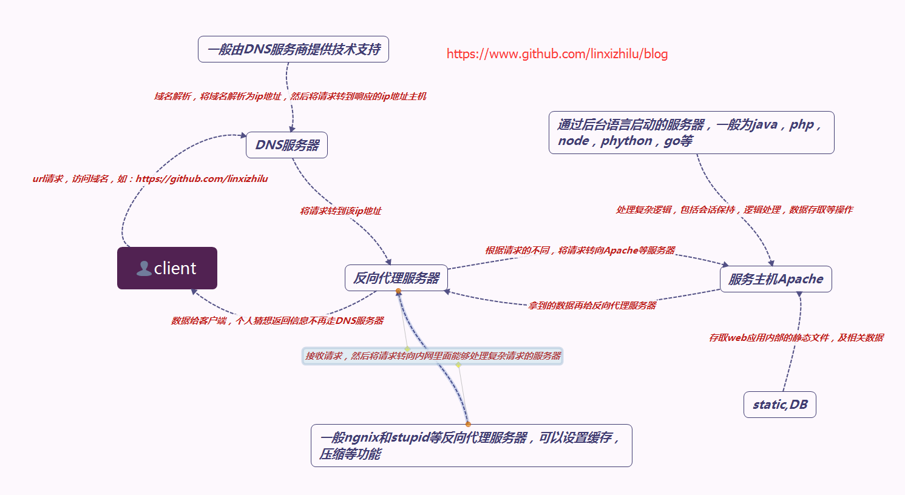
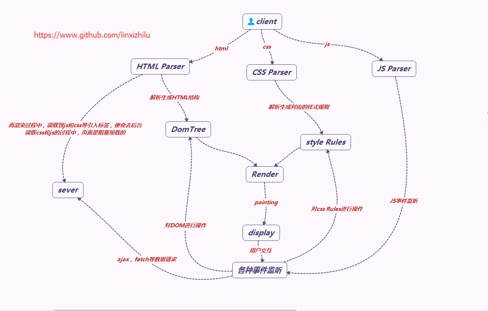

# 用户从进入页面到看见页面的web渲染的过程

## 首先看一下用户在输入域名之后，数据的返回过程

## 再看一下浏览器拿到数据后，怎样将种种数据转化为用户可见的视图

## 网上有一篇[博客](http://renyongjie668.blog.163.com/blog/static/1600531201097062789/)写的很好，在此引用一下
##### IE浏览器加载和渲染HTML的顺序
> 1. `IE`下载的顺序是从上到下，渲染的顺序也是从上到下，下载和渲染是同时进行的。
> 2. 在渲染到页面的某一部分时，其上面的所有部分都已经下载完成（并不是说所有相关联的元素都已经下载完）
> 3. 如果遇到语义解释性的标签嵌入文件（`JS`脚本，`CSS`样式），那么此时`IE`的下载过程会启用单独连接进行下载。
> 4. 并且在下载后进行解析，解析过程中，停止页面所有往下元素的下载。阻塞加载
> 5. 样式表在下载完成后，将和以前下载的所有样式表一起进行解析，解析完成后，将对此前所有元素（含以前已经渲染的）重新进行渲染。
> 6. `JS`、`CSS`中如有重定义，后定义函数将覆盖前定义函数

##### JS加载
> 不能并行下载和解析（阻塞下载）,当引用了`JS`的时候，浏览器发送1个`js request`就会一直等待该`request`的返回。因为浏览器需要1个稳定的`DOM`树结构，而`JS`中很有可能有代码直接改变了`DOM`树结构，比如使用 `document.write` 或 `appendChild`,甚至是直接使用的`location.href`进行跳转，浏览器为了防止出现`JS`修改`DOM`树，需要重新构建`DOM`树的情况，所以 就会阻塞其他的下载和呈现.

##### HTML页面加载和解析流程
> 1. 用户输入网址（假设是个`html`页面，并且是第一次访问），浏览器向服务器发出请求，服务器返回`html`文件；
> 2. 浏览器开始载入`html`代码，发现＜`head`＞标签内有一个＜`link`＞标签引用外部`CSS`文件；
> 3. 浏览器又发出`CSS`文件的请求，服务器返回这个`CSS`文件；
> 4. 浏览器继续载入`html`中`＜body＞`部分的代码，并且`CSS`文件已经拿到手了，可以开始渲染页面了；
> 5. 浏览> 器在代码中发现一个`＜img＞`标签引用了一张图片，向服务器发出请求。此时浏览器不会等到图片下载完，而是继续渲染后面的代码；
> 6. 服务器返回图片文件，由于图片占用了一定面积，影响了后面段落的排布，因此浏览器需要回过头来重新渲染这部分代码；
> 7. 浏览器发现了一个包含一行`Javascript`代码的`＜script＞`标签，赶快运行它；
> 8. `Javascript`脚本执行了这条语句，它命令浏览器隐藏掉代码中的某个`＜div＞` （`style.display=”none”`）。杯具啊，突然就少了这么一个元素，浏览器不得不重新渲染这部分代码；
> 9. 终于等到了`＜/html＞`的到来，浏览器泪流满面……
> 10. 等等，还没完，用户点了一下界面中的“换肤”按钮，`Javascript`让浏览器换了一下`＜link＞`标签的`CSS`路径；
> 11. 浏览器召集了在座的各位`＜div＞＜span＞＜ul＞＜li＞`们，“大伙儿收拾收拾行李，咱得重新来过……”，浏览器向服务器请求了新的CSS文件，重新渲染页面。

##### 知道了页面渲染的过程，那该如何优化呢
> 1. 页面减肥
> 1. 减少文件数量
> 1. 减少域名查询
> 1. 缓存重用数据
> 1. 优化页面元素加载顺序
> 1. 减少inline JavaScript的数量
> 1. 使用现代CSS和合法的标签
> 1. 指定图像和tables的大小
