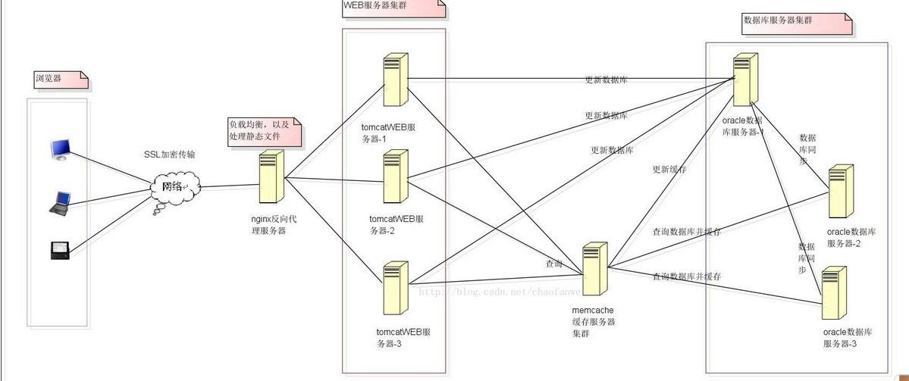
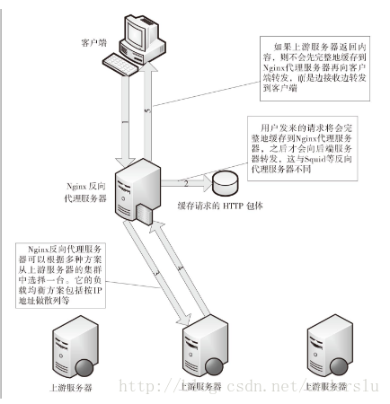

# 一些平时工作常用的小积累

## vi编辑器保存及退出命令
```javascript
:w   //保存文件但不退出vi
:w file //将修改另外保存到file中，不退出vi
:w!   //强制保存，不推出vi
:wq  //保存文件并退出vi
:wq! //强制保存文件，并退出vi
:q  //不保存文件，退出vi
:q! //不保存文件，强制退出vi
:e! //放弃所有修改，从上次保存文件开始再编辑
```
## jenkins启动停止
1. 启动`Jenkins`
> step1：进入到`Jenkins`的`war`包所在的目录如果是`win7`及以上版本，直接打开`Jenkins`的`war`包所在的目录，在地址栏敲`cmd`，回车。
<br/>
> step2：`java -jar jenkins.war`(调用里面的这个`war`包，如果你的`wa`r包名字不是`Jenkins.war`，请用你的`war`包名字，不可生搬硬套)

2. 启动`Jenkins`服务
　　`net start jenkins`  （注：如果`Jenkins`曾经启动过，启动服务不需要进入到某个目录）
3. 停止`Jenkins`服务
　　`net stop jenkins`

## ngnix常识
常规用法：`nginx` 这个轻量级、高性能的 `web server` 主要可以干两件事情：
> 直接作为`http server`(代替`apache`，对`PHP`需要`FastCGI`处理器支持)；
> 另外一个功能就是作为反向代理服务器实现负载均衡,反向代理服务器作用在服务器端，它在服务器端接收客户端的请求，然后将请求分发给具体的服务器进行处理，然后再将服务器的相应结果反馈给客户端。`Nginx`就是一个反向代理服务器软件。

<br/>



##### `Nginx`的这种工作方式为什么会降低上游服务器的负载呢？
> 通常，客户端与代理服务器之间的网络环境会比较复杂，多半是走公网,网速平均下来比较慢，因此，一个请求可能要持续很久才能完成。而代理服务器与上游服务器之间一般走内网，或者有专线连接，传输速度较快。

> `Squid`等反向代理服务器在与客户端建立连接且还没有开始接收HTTP包体时，就已经向上游服务器建立了连接。例如，某个请求要上传一个1G的文件，那么每次`Squid`在接收到一个`TCP`分包（如2KB）时，就会即时地向上游服务器转发。在接收客户端完整HTTP包体的漫长过程中，上游服务器始终要维持这个连接，这直接对上游服务器的并发处理能力提出了挑战。

> `Nginx`则不然，它在接收到完整的客户端请求（如1GB的文件）后，才会与上游服务器建立连接转发请求，由于是内网，所以这个转发过程会执行得很快。这样，一个客户端请求占用上游服务器的连接时间就会非常短，也就是说，`Nginx`的这种反向代理方案主要是为了降低上游服务器的并发压力。
